<p align="center">
  <h1 align="center">🛡️ VMPacker</h1>
  <p align="center">
    <strong>ARM64 ELF Virtual Machine Protection System</strong>
  </p>
  <p align="center">
    Translate ARM64 native instructions into custom VM bytecode for function-level code protection
  </p>
  <p align="center">
    <a href="README_CN.md">🇨🇳 中文文档</a> •
    <a href="#features">Features</a> •
    <a href="#architecture">Architecture</a> •
    <a href="#quick-start">Quick Start</a> •
    <a href="#usage">Usage</a> •
    <a href="#license">License</a>
  </p>
</p>

---

## Overview

VMPacker is a **Virtual Machine Protection (VMP)** system for **ARM64 (AArch64) Linux ELF** binaries. It decodes target function's native ARM64 instructions into an intermediate representation, translates them into custom VM bytecode, and injects an embedded VM interpreter into the ELF file. At runtime, protected functions are executed by the VM interpreter instead of natively.

### Core Concept

```
ARM64 Native Code  →  Decode  →  Translate  →  Custom VM Bytecode
                                                      ↓
                    Original ELF  ←  Inject  ←  VM Interpreter Stub
```

## Features

### 🔄 Instruction Translation Engine
- **63 VM instructions** — covering ALU, memory, branch, syscall, and more
- **Table-driven decoder** — pattern matching based on the ARM Architecture Reference Manual
- **121 ARM64 instructions** supported (base A64 100% coverage), including:
  - Arithmetic/Logic (ADD, SUB, MUL, AND, ORR, EOR, LSL, LSR, ASR, MVN, BIC, ORN, EON...)
  - Multiply-Extend (MADD, MSUB, SMADDL, SMSUBL, UMADDL, UMSUBL, SMULH, UMULH, UDIV, SDIV)
  - Data Movement (MOV, MOVZ, MOVK, MOVN)
  - Memory Access (LDR, STR, LDP, STP, LDPSW, LDADD, CAS, LDAR, STLR, LDAXR, STLXR — various widths and addressing modes)
  - Branch Control (B, BL, BR, BLR, RET, B.cond, CBZ/CBNZ, TBZ/TBNZ)
  - Conditional Select (CSEL, CSINC, CSINV, CSNEG, CCMP, CCMN)
  - Bitfield (UBFM, SBFM, BFM, EXTR)
  - Bit Manipulation (CLZ, CLS, RBIT, REV, REV16, REV32)
  - Carry Arithmetic (ADC, ADCS, SBC, SBCS)
  - SIMD Load/Store (LD1, ST1)
  - System/Barriers (SVC, MRS, MSR, ADRP/ADR, DMB, DSB, ISB, HLT, BRK, PRFM)

### 🔐 Multi-Layer Protection
| Layer | Technique | Description |
|-------|-----------|-------------|
| **VM Protection** | Custom ISA | Randomly mapped opcodes — reverse engineers cannot directly identify instruction semantics |
| **OpcodeCryptor** | Per-instruction opcode encryption | `enc[pc] = op[pc] ^ (key ^ (pc * 0x9E3779B9))` |
| **Bytecode Reversal** | Execution order reversal | Instructions stored in reverse order; interpreter traverses backwards |
| **Token Entry** | 3-instruction trampoline | Original function replaced with tokenized entry, hiding actual bytecode location |
| **Indirect Dispatch** | Function pointer jump table | Filled at runtime on the stack, breaking IDA cross-references |

### 🖥️ GUI
- Cross-platform desktop app built with **Wails v2** (Go + Vue 3)
- Element Plus UI components
- Symbol function selection + manual function input (protect by address range)
- One-click protection with real-time log output

<table>
  <tr>
    <td></td>
    <td></td>
    <td></td>
  </tr>
  <tr>
    <td align="center"><sub>Function List</sub></td>
    <td align="center"><sub>Analysis & Selection</sub></td>
    <td align="center"><sub>Protection Options</sub></td>
  </tr>
  <tr>
    <td></td>
    <td></td>
    <td></td>
  </tr>
  <tr>
    <td align="center"><sub>Real-time Logs</sub></td>
    <td align="center"><sub>Protection Complete</sub></td>
    <td></td>
  </tr>
</table>

## Architecture

```
vmp/
├── cmd/vmpacker/          # CLI entry point
│   ├── main.go            # CLI argument parsing + orchestration
│   └── vm_interp.bin      # Compiled VM interpreter (GCC, go:embed)
│
├── pkg/                   # Go core library
│   ├── arch/arm64/        # ARM64 architecture support
│   │   ├── decoder.go     # Table-driven instruction decoder (implements vm.Decoder)
│   │   ├── decode_*.go    # Decode pattern tables (DP-IMM/DP-REG/Branch/LdSt)
│   │   ├── translator.go  # ARM64 → VM bytecode translator
│   │   ├── tr_alu.go      # ALU instruction translation
│   │   ├── tr_branch.go   # Branch instruction translation
│   │   ├── tr_loadstore.go # Memory instruction translation
│   │   ├── tr_bitfield.go # Bitfield instruction translation
│   │   └── tr_special.go  # Special instructions (ADRP/ADR)
│   ├── vm/                # VM ISA definitions
│   │   ├── types.go       # Shared types + interfaces (Decoder/Translator/Packer)
│   │   ├── opcodes.go     # 58+ VM opcode definitions (randomly mapped values)
│   │   └── disasm.go      # VM bytecode disassembler
│   └── binary/elf/        # ELF binary manipulation
│       ├── packer.go      # ELF VMP injection (PT_NOTE hijack, trampoline generation)
│       └── trampoline.go  # Trampoline code generation
│
├── stub/                  # C VM interpreter (compiled to PIC flat binary)
│   ├── vm_interp_clean.c  # Interpreter main loop + entry points
│   ├── vm_types.h         # VM CPU context (vm_ctx_t)
│   ├── vm_opcodes.h       # C-side opcode definitions (synced with opcodes.go)
│   ├── vm_decode.h        # Bytecode read utilities
│   ├── vm_token.h         # Token encode/decode + descriptor table
│   ├── vm_dispatch.h      # Indirect dispatch jump table
│   ├── vm_crc.h           # CRC32 integrity check
│   ├── vm_sections.h      # Handler section scattering macros
│   ├── vm_interp.lds      # Linker script
│   └── vm_handlers/       # Modular instruction handlers
│       ├── h_alu.h        # Arithmetic/logic operations
│       ├── h_mem.h        # Memory access
│       ├── h_branch.h     # Branch/jump
│       ├── h_cmp.h        # Compare/conditional
│       ├── h_mov.h        # Data movement
│       ├── h_stack.h      # Stack (PUSH/POP)
│       └── h_system.h     # System (SVC/MRS/BLR/BR/RET)
│
├── vmp-gui/               # Wails GUI frontend
│   ├── frontend/          # Vue 3 + Element Plus
│   └── backend/           # Go backend bindings
│
└── build/                 # Pre-compiled tools + test artifacts
```

### Modular Design

The project uses an **interface-driven** modular architecture, making it easy to extend to new ISAs and binary formats:

```go
// Architecture decoder interface — extensible to x86, RISC-V
type Decoder interface {
    Decode(raw uint32, offset int) Instruction
    InstName(op int) string
}

// Bytecode translator interface
type Translator interface {
    Translate(instructions []Instruction) (*TranslateResult, error)
}

// Binary format injector interface — extensible to PE, Mach-O
type Packer interface {
    Process() error
}
```

### Protection Pipeline

```mermaid
graph LR
    A[Input ELF] --> B[Locate Target Function]
    B --> C[Extract ARM64 Instructions]
    C --> D[Decode ARM64]
    D --> E[Translate to VM Bytecode]
    E --> F[XOR Encrypt Bytecode]
    F --> G[Inject VM Interpreter]
    G --> H[Generate Trampoline]
    H --> I[Replace Function Entry]
    I --> J[Output Protected ELF]
```



## Quick Start

### Prerequisites

- **Go** 1.21+
- **GCC** (aarch64-linux-gnu-gcc) — to compile the stub
- **Linux ARM64** or cross-compilation environment

### Installation

```bash
git clone https://github.com/LeoChen-CoreMind/VMPacker.git
cd VMPacker
make all
```

## Usage

### Protect by Function Name

```bash
# Protect a single function
./vmpacker -func check_license -v -o protected.elf original.elf

# Protect multiple functions
./vmpacker -func "check_license,verify_token" -v -o protected.elf original.elf
```

### Protect by Address Range

```bash
# Specify address range
./vmpacker -addr "0x4006AC-0x400790:main" -v -o protected.elf original.elf

# Mixed mode
./vmpacker -addr "0x4006AC-0x400790:main" -func verify -o protected.elf original.elf
```

### Inspect ELF Info

```bash
./vmpacker -info input.elf
```

### CLI Options

| Option | Default | Description |
|--------|---------|-------------|
| `-func` | — | Function name(s) to protect (comma-separated) |
| `-addr` | — | Protect by address (`0xSTART-0xEND[:name]`) |
| `-o` | `input.vmp` | Output file path |
| `-v` | `false` | Verbose output (show disassembly) |
| `-strip` | `true` | Strip symbol table |
| `-debug` | `false` | Generate ARM64 → VM bytecode debug mapping file |
| `-token` | `true` | Token-based entry mode |
| `-info` | `false` | Print ELF info only |

## Building

### Compile VM Interpreter Stub

```bash
# Standard build (GCC)
aarch64-linux-gnu-gcc -Os -nostdlib -fPIC -ffreestanding \
  -o stub.elf stub/vm_interp_clean.c \
  -T stub/vm_interp.lds
aarch64-linux-gnu-objcopy -O binary stub.elf vm_interp.bin
```

### Compile CLI Tool

```bash
go build -o vmpacker ./cmd/vmpacker/
```

### Build GUI

```bash
cd vmpacker
make gui
```

## VM ISA Reference

VMPacker defines a custom Instruction Set Architecture (ISA) with **randomly mapped opcode values** to increase reverse-engineering difficulty.

> 📖 For the complete opcode table with encoding details, see the [Chinese documentation](README_CN.md#vm-isa-reference).

### Instruction Categories

| Category | Count | Description |
|----------|-------|-------------|
| Data Movement | 3 | MOV_IMM64, MOV_IMM32, MOV_REG |
| Arithmetic/Logic | 21 | ADD, SUB, MUL, XOR, AND, OR, SHL, SHR, ASR, NOT, ROR, UMULH + _IMM variants |
| Memory Access | 8 | LOAD/STORE 8/16/32/64 |
| Branch/Jump | 13 | JMP, JE, JNE, JL, JGE, JGT, JLE, JB, JAE, JBE, JA, TBZ, TBNZ |
| Compare | 6 | CMP, CMP_IMM, CCMP_REG, CCMP_IMM, CCMN_REG, CCMN_IMM |
| Stack | 2 | PUSH, POP |
| System/Special | 8 | NOP, HALT, RET, CALL_NATIVE, CALL_REG, BR_REG, SVC, MRS |
| SIMD | 2 | VLD16, VST16 |
| **Total** | **63** | |

## Roadmap

- [ ] **Full GUI Integration** — Complete GUI ↔ backend protection engine integration
- [ ] **Hybrid Mode** — Partial native execution + partial VM protection
- [ ] **Dynamic Opcode Mapping** — Generate unique ISA mapping per protection run

## Contributing

Contributions are welcome! Please follow these guidelines:

1. Fork the repository
2. Create a feature branch: `git checkout -b feature/new-arch`
3. Commit your changes: `git commit -m 'feat: add x86_64 decoder'`
4. Push the branch: `git push origin feature/new-arch`
5. Create a Pull Request

### Commit Convention

We follow [Conventional Commits](https://www.conventionalcommits.org/):

- `feat:` New feature
- `fix:` Bug fix
- `refactor:` Code refactoring
- `docs:` Documentation
- `test:` Tests

## License

This project is licensed under the **[AGPL-3.0 License](LICENSE)**.

**Why AGPL-3.0:**

- ✅ **Strong Copyleft** — Any modifications or derivative works must be open-sourced under the same license
- ✅ **Network Use Clause** — Providing this software's functionality as a network service also requires source disclosure
- ✅ **Protects Core Technology** — Prevents closed-source commercial use of the protection engine
- ✅ **Community Friendly** — Free to study, research, and improve — improvements must be shared back
- ✅ **Commercial Licensing** — For closed-source commercial use, contact the author for a commercial license

## ⚠️ Disclaimer

> THIS SOFTWARE IS PROVIDED "AS IS", WITHOUT WARRANTY OF ANY KIND, EXPRESS OR IMPLIED, INCLUDING BUT NOT LIMITED TO THE WARRANTIES OF MERCHANTABILITY, FITNESS FOR A PARTICULAR PURPOSE AND NONINFRINGEMENT. IN NO EVENT SHALL THE AUTHORS OR COPYRIGHT HOLDERS BE LIABLE FOR ANY CLAIM, DAMAGES OR OTHER LIABILITY, WHETHER IN AN ACTION OF CONTRACT, TORT OR OTHERWISE, ARISING FROM, OUT OF OR IN CONNECTION WITH THE SOFTWARE OR THE USE OR OTHER DEALINGS IN THE SOFTWARE.
>
> This project is designed to provide **legitimate intellectual property protection** for software developers, helping to safeguard core algorithms and critical code in commercial software from unauthorized reverse engineering or theft.
>
> **User Notice:**
> 1. You must comply with all applicable laws and regulations in your jurisdiction when using this software
> 2. It is strictly prohibited to use this software for any illegal purpose, including but not limited to: malware development, circumventing security audits, infringing on others' intellectual property rights, or compromising computer system security
> 3. The author(s) shall not be held liable for any direct or indirect consequences resulting from any person's use of this software
> 4. By downloading, using, or distributing this software, you acknowledge that you have read and agreed to the above terms

## Author

**LeoChen** — [@LeoChen-CoreMind](https://github.com/LeoChen-CoreMind)

Copyright © 2026 LeoChen. All rights reserved.
