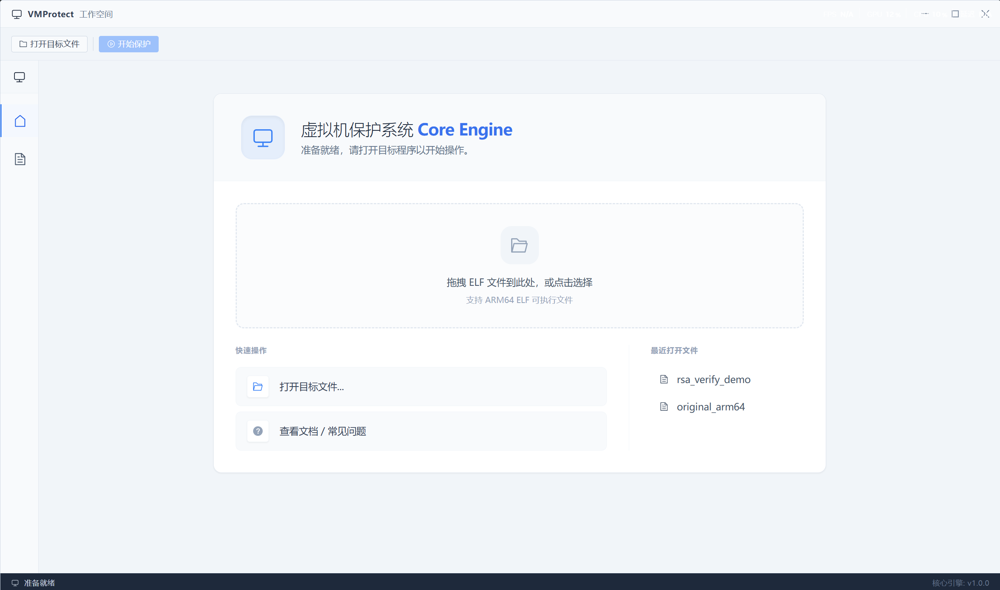
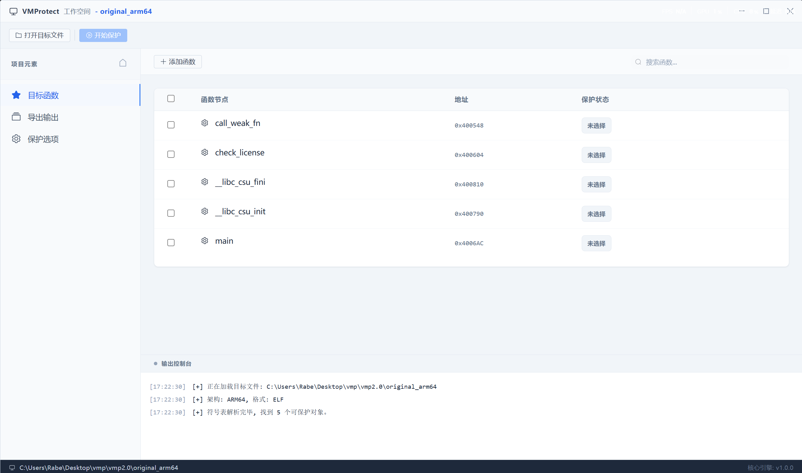
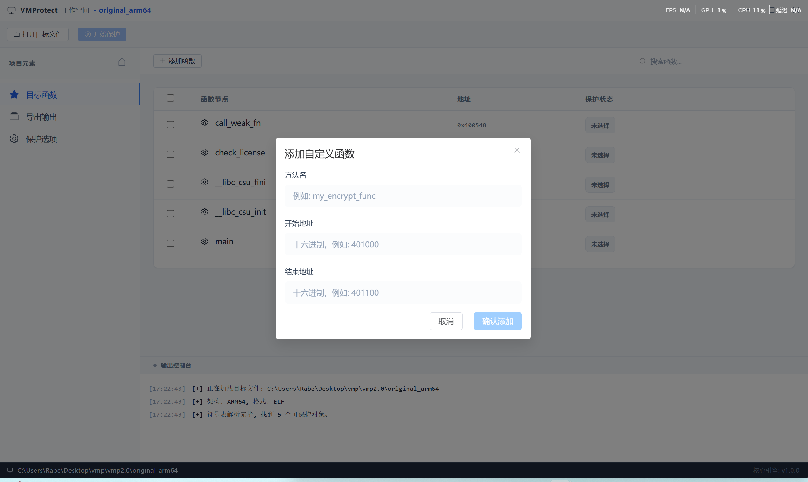
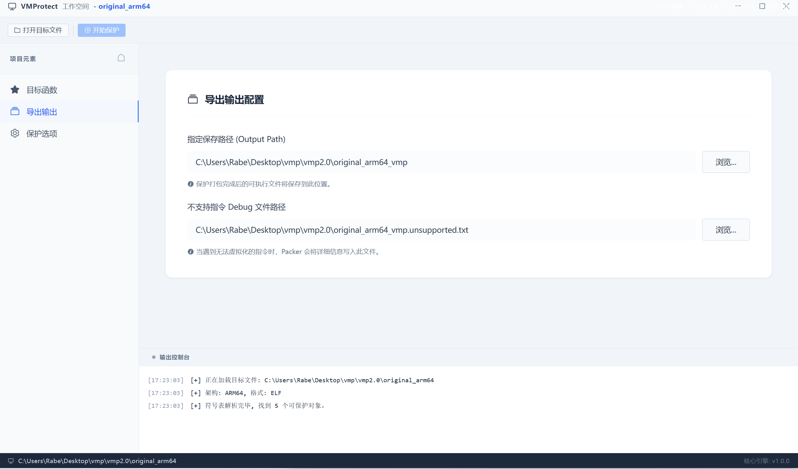
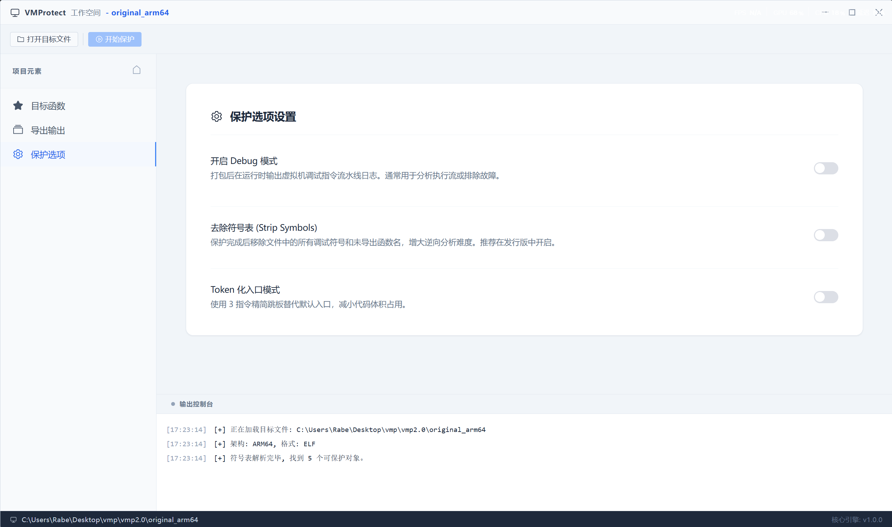

<p align="center">
  <h1 align="center">🛡️ VMPacker</h1>
  <p align="center">
    <strong>ARM64 ELF Virtual Machine Protection System</strong>
  </p>
  <p align="center">
    将 ARM64 原生指令翻译为自定义虚拟机字节码，实现函数级代码保护
  </p>
  <p align="center">
    <a href="#features">Features</a> •
    <a href="#architecture">Architecture</a> •
    <a href="#quick-start">Quick Start</a> •
    <a href="#usage">Usage</a> •
    <a href="#building">Building</a> •
    <a href="#license">License</a>
  </p>
</p>

---

## Overview

VMPacker 是一个针对 **ARM64 (AArch64) Linux ELF** 二进制文件的虚拟机代码保护（VMP）系统。它将目标函数的原生 ARM64 指令解码为中间表示，再翻译为自定义 VM 字节码，并将嵌入式 VM 解释器注入 ELF 文件中，运行时由 VM 解释执行被保护函数。

### 核心理念

```
ARM64 Native Code  →  Decode  →  Translate  →  Custom VM Bytecode
                                                      ↓
                    Original ELF  ←  Inject  ←  VM Interpreter Stub
```

## Features

### 🔄 指令翻译引擎
- **63 条 VM 指令** — 覆盖 ALU、内存、分支、系统调用等
- **表驱动解码器** — 基于 ARM Architecture Reference Manual 的模式匹配
- **121 条 ARM64 指令** 支持翻译 (base A64 100% 覆盖)，包括：
  - 算术/逻辑（ADD, SUB, MUL, AND, ORR, EOR, LSL, LSR, ASR, MVN, BIC, ORN, EON...）
  - 乘法扩展（MADD, MSUB, SMADDL, SMSUBL, UMADDL, UMSUBL, SMULH, UMULH, UDIV, SDIV）
  - 数据移动（MOV, MOVZ, MOVK, MOVN）
  - 内存访问（LDR, STR, LDP, STP, LDPSW, LDADD, CAS, LDAR, STLR, LDAXR, STLXR 各种宽度和寻址模式）
  - 分支控制（B, BL, BR, BLR, RET, B.cond, CBZ/CBNZ, TBZ/TBNZ）
  - 条件选择（CSEL, CSINC, CSINV, CSNEG, CCMP, CCMN）
  - 位域操作（UBFM, SBFM, BFM, EXTR）
  - 位操作（CLZ, CLS, RBIT, REV, REV16, REV32）
  - 进位运算（ADC, ADCS, SBC, SBCS）
  - SIMD 加载/存储（LD1, ST1）
  - 系统/屏障（SVC, MRS, MSR, ADRP/ADR, DMB, DSB, ISB, HLT, BRK, PRFM）

### 🔐 多层防护机制
| 防护层 | 技术 | 说明 |
|--------|------|------|
| **VM 保护** | 自定义 ISA | 随机映射操作码，逆向者无法直接识别指令含义 |
| **OpcodeCryptor** | 逐指令 opcode 加密 | `enc[pc] = op[pc] ^ (key ^ (pc * 0x9E3779B9))` |
| **字节码反转** | 执行序反转 | 指令按逆序存储，解释器反向遍历 |
| **Token 入口** | 3 指令跳板 | 原函数替换为 token 化入口，隐藏实际字节码位置 |
| **间接 Dispatch** | 函数指针跳转表 | 栈上运行时填充，断裂 IDA 交叉引用 |

### 🖥️ GUI 界面
- 基于 **Wails v2** (Go + Vue 3) 的跨平台桌面应用
- Element Plus UI 组件
- 支持符号函数选择 + 手动添加函数（按地址范围保护）
- 一键保护，日志实时输出

<table>
  <tr>
    <td></td>
    <td></td>
    <td></td>
  </tr>
  <tr>
    <td align="center"><sub>目标函数列表</sub></td>
    <td align="center"><sub>函数分析选择</sub></td>
    <td align="center"><sub>保护选项配置</sub></td>
  </tr>
  <tr>
    <td></td>
    <td></td>
    <td></td>
  </tr>
  <tr>
    <td align="center"><sub>实时日志输出</sub></td>
    <td align="center"><sub>保护完成反馈</sub></td>
    <td></td>
  </tr>
</table>

## Architecture

```
vmp/
├── cmd/vmpacker/          # CLI 入口
│   ├── main.go            # 命令行参数解析 + 流程编排
│   └── vm_interp.bin      # 编译后的 VM 解释器 (GCC, go:embed)
│
├── pkg/                   # Go 核心库
│   ├── arch/arm64/        # ARM64 架构支持
│   │   ├── decoder.go     # 表驱动指令解码器 (实现 vm.Decoder)
│   │   ├── decode_*.go    # 解码模式表 (DP-IMM/DP-REG/Branch/LdSt)
│   │   ├── translator.go  # ARM64 → VM 字节码翻译器
│   │   ├── tr_alu.go      # ALU 指令翻译
│   │   ├── tr_branch.go   # 分支指令翻译
│   │   ├── tr_loadstore.go # 内存指令翻译
│   │   ├── tr_bitfield.go # 位域指令翻译
│   │   └── tr_special.go  # 特殊指令翻译 (ADRP/ADR)
│   ├── vm/                # VM ISA 定义
│   │   ├── types.go       # 公共类型 + 接口 (Decoder/Translator/Packer)
│   │   ├── opcodes.go     # 58+ 条 VM 操作码定义 (随机映射值)
│   │   └── disasm.go      # VM 字节码反汇编器
│   └── binary/elf/        # ELF 二进制操作
│       ├── packer.go      # ELF VMP 注入 (PT_NOTE hijack, 跳板生成)
│       └── trampoline.go  # 跳板代码生成
│
├── stub/                  # C VM 解释器 (编译为 PIC flat binary)
│   ├── vm_interp_clean.c  # 解释器主循环 + 入口点
│   ├── vm_types.h         # VM CPU 上下文 (vm_ctx_t)
│   ├── vm_opcodes.h       # C 侧操作码定义 (与 opcodes.go 同步)
│   ├── vm_decode.h        # 字节码读取工具函数
│   ├── vm_token.h         # Token 编解码 + 描述符表
│   ├── vm_dispatch.h      # 间接 Dispatch 跳转表
│   ├── vm_crc.h           # CRC32 完整性校验
│   ├── vm_sections.h      # Handler Section 分散宏
│   ├── vm_interp.lds      # 链接脚本
│   └── vm_handlers/       # 模块化指令处理器
│       ├── h_alu.h        # 算术/逻辑运算
│       ├── h_mem.h        # 内存访问
│       ├── h_branch.h     # 分支/跳转
│       ├── h_cmp.h        # 比较/条件
│       ├── h_mov.h        # 数据移动
│       ├── h_stack.h      # 栈操作 (PUSH/POP)
│       └── h_system.h     # 系统 (SVC/MRS/BLR/BR/RET)
│
├── vmp-gui/               # Wails GUI 前端
│   ├── frontend/          # Vue 3 + Element Plus
│   └── backend/           # Go 后端绑定
│
└── build/                 # 预编译工具 + 测试产物
```

### 模块化设计

项目采用**接口驱动**的模块化架构，便于扩展到新的指令集和二进制格式：

```go
// 架构解码器接口 — 未来可扩展 x86, RISC-V
type Decoder interface {
    Decode(raw uint32, offset int) Instruction
    InstName(op int) string
}

// 字节码翻译器接口
type Translator interface {
    Translate(instructions []Instruction) (*TranslateResult, error)
}

// 二进制格式注入器接口 — 未来可扩展 PE, Mach-O
type Packer interface {
    Process() error
}
```

### 保护流程


## Quick Start

### 前置要求

- **Go** 1.21+
- **GCC** (aarch64-linux-gnu-gcc) — 编译 stub
- **Python** 3.8+ — 自动化脚本
- **Linux ARM64** 或交叉编译环境

### 安装

```bash
git clone https://github.com/LeoChen-CoreMind/VMPacker.git
cd VMPacker
make all
```

## Usage

### 按函数名保护

```bash
# 保护单个函数
./vmpacker -func check_license -v -o protected.elf original.elf

# 保护多个函数
./vmpacker -func "check_license,verify_token" -v -o protected.elf original.elf
```

### 按地址范围保护

```bash
# 指定地址范围
./vmpacker -addr "0x4006AC-0x400790:main" -v -o protected.elf original.elf

# 混合模式
./vmpacker -addr "0x4006AC-0x400790:main" -func verify -o protected.elf original.elf
```

### 查看 ELF 信息

```bash
./vmpacker -info input.elf
```

### CLI 选项

| 选项 | 默认值 | 说明 |
|------|--------|------|
| `-func` | — | 要保护的函数名（逗号分隔） |
| `-addr` | — | 按地址保护（格式: `0xSTART-0xEND[:name]`） |
| `-o` | `input.vmp` | 输出文件路径 |
| `-v` | `false` | 详细输出（显示反汇编） |
| `-strip` | `true` | 清除符号表 |
| `-debug` | `false` | 生成 ARM64 → VM 字节码对照文件 |
| `-token` | `true` | Token 化入口模式 |
| `-info` | `false` | 仅打印 ELF 信息 |

## Building

### 编译 VM 解释器 Stub

```bash
# 标准版 (GCC)
aarch64-linux-gnu-gcc -Os -nostdlib -fPIC -ffreestanding \
  -o stub.elf stub/vm_interp_clean.c \
  -T stub/vm_interp.lds
aarch64-linux-gnu-objcopy -O binary stub.elf vm_interp.bin

# OLLVM 混淆版
# 使用 OLLVM 交叉编译器替换 GCC，启用 -mllvm 混淆选项
```

### 编译 CLI 工具

```bash
# vmpacker (Go 二进制，内嵌 stub blob)
go build -o vmpacker ./cmd/vmpacker/
```

### 编译 GUI

```bash
cd vmpacker
make gui
```

## VM ISA Reference

VMPacker 定义了一套自定义指令集架构（ISA），操作码采用**随机映射值**以增加逆向难度。

### 操作码分类

<details>
<summary><b>📦 数据移动 (3 条)</b></summary>

| 操作码 | 助记符 | 格式 | 说明 |
|--------|--------|------|------|
| `0x5A` | MOV_IMM64 | `[op][r][imm64]` 10B | 64 位立即数加载 |
| `0x49` | MOV_IMM32 | `[op][r][imm32]` 6B | 32 位立即数加载 |
| `0x2F` | MOV_REG | `[op][d][s]` 3B | 寄存器间移动 |

</details>

<details>
<summary><b>🔢 算术/逻辑 (21 条)</b></summary>

| 操作码 | 助记符 | 格式 | 说明 |
|--------|--------|------|------|
| `0x37` | ADD | `[op][d][n][m]` 4B | 加法 |
| `0x6E` | SUB | `[op][d][n][m]` 4B | 减法 |
| `0x83` | MUL | `[op][d][n][m]` 4B | 乘法 |
| `0x1B` | XOR | `[op][d][n][m]` 4B | 异或 |
| `0x4D` | AND | `[op][d][n][m]` 4B | 与 |
| `0x72` | OR | `[op][d][n][m]` 4B | 或 |
| `0xAE` | SHL | `[op][d][n][m]` 4B | 逻辑左移 |
| `0xF1` | SHR | `[op][d][n][m]` 4B | 逻辑右移 |
| `0xDA` | ASR | `[op][d][n][m]` 4B | 算术右移 |
| `0x08` | NOT | `[op][d][n]` 3B | 按位取反 |
| `0x3D` | ROR | `[op][d][n][m]` 4B | 循环右移 |
| `0xF2` | UMULH | `[op][d][n][m]` 4B | 无符号高位乘 |
| `0xE5` | ADD_IMM | `[op][d][s][imm32]` 7B | 立即数加 |
| `0x78` | SUB_IMM | `[op][d][s][imm32]` 7B | 立即数减 |
| `0x3C` | XOR_IMM | `[op][d][s][imm32]` 7B | 立即数异或 |
| `0xD9` | AND_IMM | `[op][d][s][imm32]` 7B | 立即数与 |
| `0x6B` | OR_IMM | `[op][d][s][imm32]` 7B | 立即数或 |
| `0xB3` | MUL_IMM | `[op][d][s][imm32]` 7B | 立即数乘 |
| `0x7A` | SHL_IMM | `[op][d][s][imm32]` 7B | 立即数左移 |
| `0x8C` | SHR_IMM | `[op][d][s][imm32]` 7B | 立即数右移 |
| `0x9D` | ASR_IMM | `[op][d][s][imm32]` 7B | 立即数算术右移 |

</details>

<details>
<summary><b>💾 内存访问 (8 条)</b></summary>

| 操作码 | 助记符 | 格式 | 说明 |
|--------|--------|------|------|
| `0x91` | LOAD8 | `[op][d][b][off16]` 5B | 字节加载 |
| `0xE7` | LOAD16 | `[op][d][b][off16]` 5B | 半字加载 |
| `0xA4` | LOAD32 | `[op][d][b][off16]` 5B | 字加载 |
| `0xB7` | LOAD64 | `[op][d][b][off16]` 5B | 双字加载 |
| `0xD2` | STORE8 | `[op][b][s][off16]` 5B | 字节存储 |
| `0xE8` | STORE16 | `[op][b][s][off16]` 5B | 半字存储 |
| `0x19` | STORE32 | `[op][b][s][off16]` 5B | 字存储 |
| `0x2A` | STORE64 | `[op][b][s][off16]` 5B | 双字存储 |

</details>

<details>
<summary><b>🔀 分支/跳转 (13 条)</b></summary>

| 操作码 | 助记符 | 格式 | 说明 |
|--------|--------|------|------|
| `0x44` | JMP | `[op][target32]` 5B | 无条件跳转 |
| `0x58` | JE | `[op][target32]` 5B | 等于跳转 |
| `0xBB` | JNE | `[op][target32]` 5B | 不等跳转 |
| `0x15` | JL | `[op][target32]` 5B | 有符号小于 |
| `0x29` | JGE | `[op][target32]` 5B | 有符号大于等于 |
| `0x36` | JGT | `[op][target32]` 5B | 有符号大于 |
| `0x47` | JLE | `[op][target32]` 5B | 有符号小于等于 |
| `0x52` | JB | `[op][target32]` 5B | 无符号小于 |
| `0x64` | JAE | `[op][target32]` 5B | 无符号大于等于 |
| `0x53` | JBE | `[op][target32]` 5B | 无符号小于等于 |
| `0x65` | JA | `[op][target32]` 5B | 无符号大于 |
| `0x16` | TBZ | `[op][r][bit][t32]` 7B | 位测试为零跳转 |
| `0x17` | TBNZ | `[op][r][bit][t32]` 7B | 位测试非零跳转 |

</details>

<details>
<summary><b>⚙️ 系统/特殊 (13 条)</b></summary>

| 操作码 | 助记符 | 格式 | 说明 |
|--------|--------|------|------|
| `0xC3` | NOP | `[op]` 1B | 空操作 |
| `0x00` | HALT | `[op]` 1B | 停机 |
| `0xEE` | RET | `[op][r]` 2B | 返回 |
| `0x63` | PUSH | `[op][r]` 2B | 入栈 |
| `0x27` | POP | `[op][r]` 2B | 出栈 |
| `0xAB` | CALL_NATIVE | `[op][imm64]` 9B | 原生函数调用 |
| `0xBC` | CALL_REG | `[op][rn]` 2B | 寄存器间接调用 (BLR) |
| `0xCD` | BR_REG | `[op][rn]` 2B | 寄存器间接跳转 (BR) |
| `0x9F` | CMP | `[op][n][m]` 3B | 寄存器比较 |
| `0xA1` | CMP_IMM | `[op][n][imm32]` 6B | 立即数比较 |
| `0x1E` | SVC | `[op][imm16]` 3B | 系统调用 |
| `0x1F` | UDIV | `[op][d][n][m]` 4B | 无符号除法 |
| `0x20` | MRS | `[op][d][sysreg16]` 4B | 读系统寄存器 |

</details>

## Roadmap


- [ ] **GUI 完整适配** — 完善 GUI 与后端保护引擎的完整集成
- [ ] **混合模式** — 部分指令原生执行 + 部分 VM 保护
- [ ] **动态操作码映射** — 每次保护生成不同 ISA 映射

## Contributing

欢迎贡献代码！请遵循以下规范：

1. Fork 本仓库
2. 创建特性分支: `git checkout -b feature/new-arch`
3. 提交更改: `git commit -m 'feat: add x86_64 decoder'`
4. 推送分支: `git push origin feature/new-arch`
5. 创建 Pull Request

### Commit Convention

采用 [Conventional Commits](https://www.conventionalcommits.org/) 规范：

- `feat:` 新功能
- `fix:` Bug 修复
- `refactor:` 重构
- `docs:` 文档
- `test:` 测试

## License

本项目采用 **[AGPL-3.0 License](LICENSE)** 开源协议。

**为什么选择 AGPL-3.0：**

- ✅ **强 Copyleft** — 任何修改或衍生作品必须以相同协议开源
- ✅ **网络使用条款** — 通过网络服务提供本软件功能时，也必须公开源码
- ✅ **保护核心技术** — 防止他人将核心保护引擎闭源商用
- ✅ **社区友好** — 允许学习、研究、改进，但改进必须回馈社区
- ✅ **商业许可** — 如需闭源商用，可联系作者获取商业许可

## ⚠️ Disclaimer / 免责声明

> **中文版**
>
> 本软件按"**原样**"（AS IS）提供，**不附带任何形式的明示或暗示担保**，包括但不限于对适销性、特定用途适用性和非侵权性的担保。在任何情况下，作者或版权持有人均不对因使用或无法使用本软件而产生的任何索赔、损害或其他责任负责，无论是在合同诉讼、侵权诉讼还是其他诉讼中。
>
> 本项目的设计初衷是为**软件开发者提供合法的知识产权保护手段**，帮助保护商业软件中的核心算法和关键代码不被轻易逆向或盗用。
>
> **使用者须知：**
> 1. 使用本软件时，您必须遵守所在国家/地区的法律法规
> 2. 禁止将本软件用于任何非法目的，包括但不限于：恶意软件开发、规避安全审计、侵犯他人知识产权、破坏计算机系统安全等
> 3. 作者不对任何人使用本软件造成的直接或间接后果承担法律责任
> 4. 下载、使用或分发本软件即表示您已阅读并同意上述条款

> **English Version**
>
> THIS SOFTWARE IS PROVIDED "AS IS", WITHOUT WARRANTY OF ANY KIND, EXPRESS OR IMPLIED, INCLUDING BUT NOT LIMITED TO THE WARRANTIES OF MERCHANTABILITY, FITNESS FOR A PARTICULAR PURPOSE AND NONINFRINGEMENT. IN NO EVENT SHALL THE AUTHORS OR COPYRIGHT HOLDERS BE LIABLE FOR ANY CLAIM, DAMAGES OR OTHER LIABILITY, WHETHER IN AN ACTION OF CONTRACT, TORT OR OTHERWISE, ARISING FROM, OUT OF OR IN CONNECTION WITH THE SOFTWARE OR THE USE OR OTHER DEALINGS IN THE SOFTWARE.
>
> This project is designed to provide **legitimate intellectual property protection** for software developers, helping to safeguard core algorithms and critical code in commercial software from unauthorized reverse engineering or theft.
>
> **User Notice:**
> 1. You must comply with all applicable laws and regulations in your jurisdiction when using this software
> 2. It is strictly prohibited to use this software for any illegal purpose, including but not limited to: malware development, circumventing security audits, infringing on others' intellectual property rights, or compromising computer system security
> 3. The author(s) shall not be held liable for any direct or indirect consequences resulting from any person's use of this software
> 4. By downloading, using, or distributing this software, you acknowledge that you have read and agreed to the above terms

## Author

**LeoChen** — [@LeoChen-CoreMind](https://github.com/LeoChen-CoreMind)

Copyright © 2026 LeoChen. All rights reserved.

